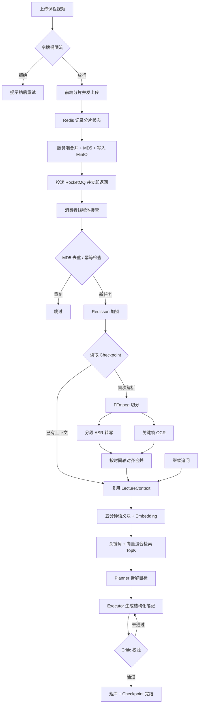

<div align="center">

<h1 align="center">CourseGist · AI 课程视频学习平台</h1>

<p align="center">
    <strong>GB 级课程稳定上传 / 音画双通道内容理解 / 目标驱动的笔记生成</strong>
</p>

</div>

网课平台解决的是"看"的问题，CourseGist 想解决的是"学"的问题：把一节一两个小时的课程视频，变成带时间戳证据、可以继续追问的结构化学习笔记。

平台覆盖从用户鉴权、分片上传、音频提取、语音转写、关键帧 OCR，到 AI 生成结构化笔记的完整链路。针对课程视频场景里最常见的三类工程问题——**解析耗时长导致接口阻塞**、**热门课程被并发重复解析**、**大文件在弱网下传不完**——系统以 RocketMQ 异步化、Redisson 分布式锁与分片断点续传为核心做了整体设计。

## 系统能力

### 上传链路：大文件也要传得稳

前端把课程视频切成 5MB 分片并发上传，Redis 以 Set 记录每个上传会话已完成的分片序号；网络中断后重新进入页面，只补传缺失分片即可。全部分片就位后由服务端合并、校验 MD5 并写入 MinIO。

上传接口本身不做任何解析。合并完成后仅创建任务记录并向 RocketMQ 投递一条消息即返回，原本一分钟以上的同步等待被压缩到毫秒级，解析全部由消费者在业务线程池中异步完成。

### 并发防护：同一节课只解析一次

- **内容级去重**：以视频 MD5 作为内容指纹，Redisson 分布式锁（含 WatchDog 自动续期）保证同一内容同时只有一个解析任务在跑，转码耗时再长也不会因锁过期而放进第二个任务。
- **消费幂等**：按「课程 + 学习目标」记录完成状态，RocketMQ 重复投递时直接复用既有结果。
- **限流与重试**：入口处使用 Redis 令牌桶限制每分钟解析次数，防止恶意刷量烧掉 Token；ASR 与大模型接口遇到 5xx / 网络抖动时按指数退避做有限次重试。

### 内容理解：音画对齐的 LectureContext

FFmpeg 先把课程按 60 秒切分音频、并基于场景变化抽取关键帧，随后两条通道并行工作：

- 语音侧：分段 ASR，产出带起止时间的讲稿片段；
- 画面侧：关键帧 OCR，捕捉板书、PPT 与代码等画面文字。

两路结果按时间窗对齐，合并为统一的 `LectureSegment`：

```text
[15:00 - 15:30]

ASR：我们接着看快速排序的分区过程
OCR：partition(arr, low, high) —— 基准元素归位
证据帧：frame_000087.jpg
```

若干 `LectureSegment` 组成整节课的 `LectureContext`，供后续 Agent 检索、引用与校验。

### 长课程检索：先压缩，再按需装载

对超过五分钟的课程，系统以五分钟为粒度构建语义块（`LectureChunk`），每块包含摘要、关键词、时间范围、原始片段与 Embedding 向量。Agent 检索时默认只看摘要层，通过「关键词命中 + Embedding 余弦相似度」混合打分排序，仅把 Top-K 命中块的原始证据装载进上下文——既避免整节课文本一次性塞给模型，也减少无关内容的干扰。

### 笔记生成：Planner → Executor → Critic

生成环节采用受控 Agent 工作流而非单发 Prompt：

| 角色 | 职责 |
| --- | --- |
| Planner | 理解学习目标，拆解为 3~5 个仅凭课程证据即可完成的子任务 |
| Executor | 按计划检索证据，产出带时间戳引用的结论与学习建议 |
| Critic | 校验目标覆盖度、证据一致性与结构完整性 |

Critic 不通过时把具体反馈交还 Executor 定向修正，最多两轮后强制收敛。最终产物是固定结构的 JSON：

```json
{
  "title": "笔记标题",
  "conclusions": ["核心知识点"],
  "evidence": [
    { "timestampMs": 900000, "source": "OCR", "content": "对应的课堂证据" }
  ],
  "suggestions": ["学习建议"]
}
```

### 阶段级 Checkpoint 与继续追问

长课程解析包含多个高耗时阶段，任何一步失败都不该从头再来。系统在 Redis 中按阶段保存中间产物（`CONTEXT_COMPLETED → PLAN_COMPLETED → CRITIC_COMPLETED → ANALYSIS_COMPLETED`），任务恢复时从最近的成功阶段继续：已有 LectureContext 就跳过 ASR/OCR，已有计划就复用计划。

Checkpoint 以「课程 ID + 学习目标」为粒度隔离，因此同一节课换一个提问角度会生成另一份笔记；而首次解析完成后，用户继续追问只需复用既有 LectureContext 重新走一遍检索与 Agent 流程，无需再次上传或转写。

## 处理流程



## 技术栈

- **后端**：Spring Boot 3 / MyBatis-Plus / MySQL / Redis / Redisson / RocketMQ / MinIO / FFmpeg / LangChain4j
- **AI**：ASR 转写 · 关键帧 OCR · DeepSeek 系列模型 · BGE-M3 Embedding · Planner-Executor-Critic 工作流
- **前端**：Vue 3 + Vite
- **部署**：Docker Compose 一键拉起全部中间件

## 环境要求

| 组件 | 版本建议 |
| --- | --- |
| JDK | 21+（Spring Boot 3 要求 17+） |
| Node.js | 20+ |
| MySQL | 8.0（compose 内置） |
| Redis | 7.x（compose 内置） |
| RocketMQ | 4.9.4（compose 内置） |
| FFmpeg | 较新的稳定版即可 |
| yt-dlp | 建议定期 `yt-dlp -U` 更新解析库 |
| Tesseract | 需安装 `chi_sim` 语言包 |

## 本地运行

**1. 启动中间件**

```bash
docker-compose up -d
```

**2. 初始化数据库**

```bash
mysql -h127.0.0.1 -P3307 -uroot -proot < sql/init.sql
```

**3. 修改后端配置** `server/src/main/resources/application.properties`

```properties
# 前往 https://cloud.siliconflow.cn 申请自己的 Key（有免费额度），切勿提交到 Git
ai.llm.api-key=sk-你的密钥

# 本地工具链路径（Windows 使用正斜杠）
tool.ffmpeg.dir=D:/ffmpeg/bin
tool.ytdlp.path=D:/yt-dlp/yt-dlp.exe
```

**4. 启动后端**

```bash
cd server
mvn clean spring-boot:run
# 控制台出现 Started CourseGistApplication 即启动成功
```

**5. 启动前端**

```bash
cd client
npm install
npm run dev
# 浏览器访问 http://localhost:5173
```
